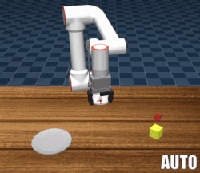
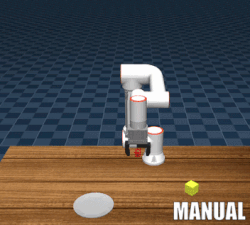
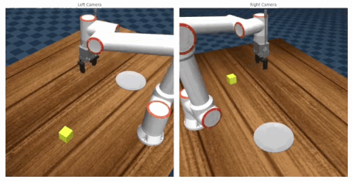

# Fairino Cobot FR5 Mujoco VLA Environment

A flexible MuJoCo environment for the Fairino Cobot FR5, designed specifically for recording Vision-Language-Action (VLA) datasets. This repository provides an out-of-the-box setup to record dual camera views and proprioceptive data using either automated scripts or manual control via an Xbox 360 controller.

The environment is built to be easily customizable so you can modify it for your specific manipulation tasks.

## Previews

**Control Modes:**




**Dataset Recording:**



## Installation

1. Clone this repository:

    ```bash
    git clone git@github.com:CoRoLab-Berlin/fr5_mujoco_env.git
    ```

1. Create and activate a virtual environment (Python 3.12+ recommended):

    ```bash
    python -m venv .venv
    source .venv/bin/activate
    ```

1. Install the python package with the required dependencies:

    ```bash
    pip install -e .
    ```

### Quick usage

Run the `play_scene.py` script to test the MuJoCo environment (with or without the Xbox controller):

```bash
python scripts/play_recording.py
```

To replay your recorded VLA datasets, use the `play_recording.py` script:

```bash
python scripts/play_recording.py
```

## Dataset Format & Outputs

Data is recorded in **HDF5 format**, structured to be compatible with modern VLA and Imitation Learning pipelines (e.g., ACT, Diffusion Policy). Each file represents one episode.

### HDF5 Structure

```text
root
  ├── action: (eps_len, 10)                     # Padded control vector (see breakdown below)
  ├── language_raw: (1,)
  └── observations
      ├── images
      │   ├── left: (eps_len, 512, 512, 3)
      │   ├── right: (eps_len, 512, 512, 3)
      ├── joint_positions: (eps_len, 7)
      ├── qpos: (eps_len, 7)
      └── qvel: (eps_len, 7)
```

> Note: Data has this structure as this project was initially designed for recording VLA datasets for training the TinyVLA.

**Action Vector Breakdown:**

The `action` vector is fixed at 10 dimensions for compatibility with TinyVLA which this project was originally designed for. It is populated as follows:

* Indices 0-5: Desired joint positions (`q_des`) for the 6-DOF arm.
* Index 6: Gripper command.
* Indices 7-9: Unused (Zero-padded).

## Xbox 360 Controller Setup

If you wish to use an Xbox controller for manual teleoperation and data collection, follow these steps:

1. Add yourself to the `input` group (system restart required):

    ```bash
    sudo usermod -aG input $USER
    ```

1. Install the driver for the Xbox 360 controller:

    ```bash
    sudo apt install xboxdrv
    ```

    > Tip: You can test if the controller is detected by running: ``sudo xboxdrv --detach-kernel-driver``

1. Add a udev rule to allow non-root users to access the controller (so you don't have to run Python scripts with sudo):

    ```bash
    sudo tee /etc/udev/rules.d/99-xbox-controller.rules > /dev/null <<'EOF'; sudo udevadm control --reload-rules; sudo udevadm trigger
    SUBSYSTEM=="input", ATTRS{idVendor}=="045e", MODE="0666"
    SUBSYSTEM=="usb", ATTRS{idVendor}=="045e", MODE="0666"
    EOF
    ```

## Related Links

* Fairino Cobot FR5 Model: <https://github.com/ma-weiss/Fairino-Mujoco/tree/main>
* diffik: <https://github.com/kevinzakka/mjctrl>
* Xbox controller driver: <https://github.com/xboxdrv>
